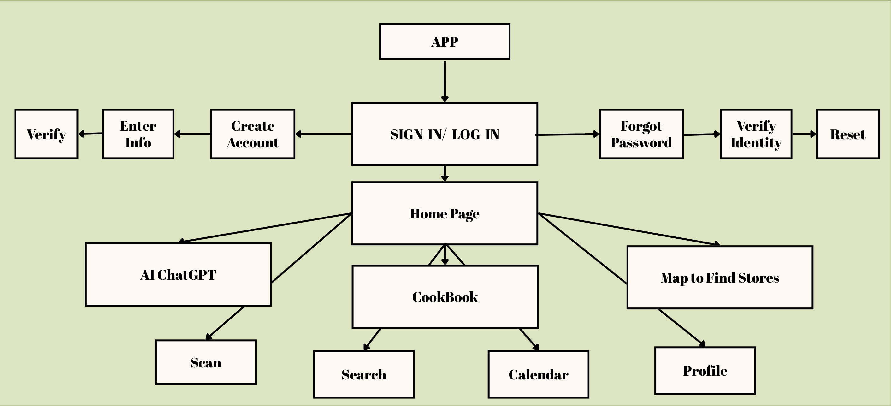
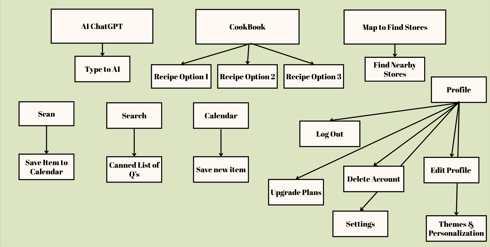

# PalEntry - Group 6 

## Purpose 
PalEntry helps users reduce waste by scanning their groceries, tracking expiration dates, and viewing them in a clear calendar layout. The app sends reminders for items expiring soon and includes an integrated AI that suggests recipes using those ingredients. Users can also save and organize recipes from others for later use.

## Contributers
- 🥑 [Lakshmi Jinkala](https://github.com/lakshmijinkala)
- 🫐 [Le Gia Nguyen](https://github.com/GiaKhanhDe)
- 🍒 [Kelsey Knight](https://github.com/johnsmith)

## Features
### Log-In 
*SignIn*
* The User has the option to sign up on the app, with their phone number or their email address.

*LogIn*
* The User has the option of logging into their account with their chosen login credentials.
* They have the option of resetting their password if they forget it. 

### Homepage 
* User should be able to view different recipes from different users.
* The User should be able to save recipes they have found on their feed.
* User should be able to navigate to the cookbook, the store locator, and the PantryPal through buttons at the top of the page.

### AI Chatbot
* The User will be able to provide information about their pantry, such as the food items within the pantry, (optional) the amount of goods, (optional).
* The System/AI will provide detailed advice based on the information provided.

### AI Canned Questions 
* The User will see a dropdown or button group of “canned” AI questions for quick interaction.
* Example options: “What can I cook in under 10 minutes?”, “What recipes use my soon-to-expire items?”, “What’s a healthy meal with pasta?”
* The AI will generate a focused 200-word reply for whichever option is selected.

### Store Locator 
* The User has the option of viewing the stores near them in two ways: a list view or a map view.
* The list view provides all stores within a specified radius of the user, with colors that indicate the availability of the product asked for.
* The button should either lead them to the store's DoorDash or Instacart page. 

### CookBook
* The User should be able to save different recipes from the Pantry Pal chat messages.
* They should also know when they’ve saved the recipe.
* They should also be able to categorize the saved recipes by product availability. The categories could be:
  * Green: All ingredients available
  * Yellow: Some available
  * Red: None available 

## Complete Workflow

## Splitting our Work
[Lakshmi Jinkala](https://github.com/lakshmijinkala): Read Me file, AI Canned Questions, Homepage

[Le Gia Nguyen](https://github.com/GiaKhanhDe): Log-in, Sign-In 

[Kelsey Knight](https://github.com/johnsmith): AI Chatbot, Store Locator, Cookbook

<!-- ## Technologies Used
Content goes here...
-->

## Contact Us! 

